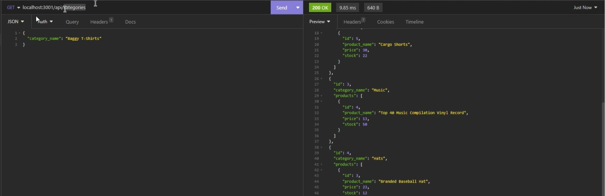

# sql-ecommerce-backend

## Description

The motivation behind this project was to practice and clarify concepts and understanding related to the use of sequelize to make SQL queries, further consolodation of the use of expressJS and it's routing applications for building one's own API and model constructors. This application was fairly easy in terms of design, but required significant research and learning when it came sequelize syntax - for which the documentation is lacking in examples relatable to this kind of project. I much better understand the use of SQL and other modules we previously touched on after completing this - An entirely backend application that you can access via insomnia to make calls to the SQL database. 

## Table of Contents

- [Description](#description)
- [Usage](#usage)
- [Deployment](#deployment)
- [Credits](#credits)
- [License](#license)

## Installation

Run NPM install prior to use.
Log into mySQL shell and use the source command on the schema.sql file.
Use command NPM run seed to seed the database.
Use NPM start to start the server.

## Usage

After the user has used the command npm start from the integrated terminal the server will start. 
From this point the user can make Get, Post, Put, and Delete calls to the database concerning categories/products or tags by using the appropriate route using Insomnia.
e.g. Localhost:3001/Categories/3.
When a valid request is made using JSON the application will update the database.

Screenshot:

## Deployment

The video demonstration of the application:
(https://drive.google.com/file/d/1PcL6d_hlg8tJK38QeF715TNxqZtW2WSJ/view)

## Credits

This project makes use of starter code.

It also makes use of nodeJS, mysql2, expressJS and Sequelize.

The rest is my own work.

Credit also to my teachers, as without them this would not have been possible.

## License

Licensed under the MIT license.

